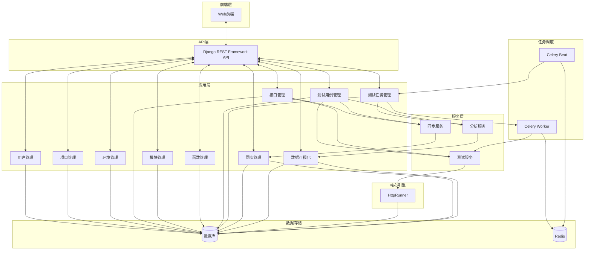

# TestRunner

一个基于Django REST Framework和Vue3的现代化接口测试平台。

蚂蚁自动化平台 是一个基于 Django 和 HttpRunner 构建的自动化测试平台,旨在提供一个完整的接口自动化测试解决方案。该平台集成了项目管理、环境配置、接口管理、测试用例编写、测试任务执行和结果分析等功能，为测试团队提供了一站式的测试服务。

## 项目截图

### 登录页面


### 仪表盘界面


### 接口管理界面


### 测试用例编辑界面


## ✨ 特性

- 🎯 **接口管理**：完整的API接口管理和调试功能
- 📝 **测试用例**：灵活的测试用例编写和管理
- 🔄 **测试任务**：支持批量执行和定时任务
- 📊 **测试报告**：详细的测试结果展示和统计
- 🗃️ **数据库操作**：内置SQL钩子支持
- 🌐 **环境管理**：多环境配置和变量管理
- 🔧 **自定义函数**：支持Python自定义函数扩展

## 项目概述

蚂蚁自动化平台 平台通过整合多种测试工具和技术，提供了一个全面的接口自动化测试解决方案。平台的核心是基于 HttpRunner 测试引擎，结合 Django 框架构建的 Web 应用，支持多种协议的接口测试，包括 HTTP 和 SQL 接口。

平台提供了完整的测试生命周期管理，从项目管理、环境配置、接口定义、测试用例编写到测试执行和结果分析，为测试团队提供了一站式的测试服务。同时，平台还支持接口与测试用例的同步更新，有效降低了测试维护成本。

## 核心功能

### 1. 项目管理

- **项目创建与配置**：支持创建多个项目，并为每个项目配置不同的测试环境和成员
- **成员管理**：可以为项目添加多个成员，并分配不同的权限
- **模块管理**：支持在项目内创建多级模块，便于组织和管理测试资源

### 2. 环境管理

- **多环境支持**：可以为每个项目配置多个测试环境（如开发、测试、预发布、生产等）
- **环境变量**：支持为每个环境配置特定的变量，用于测试用例执行
- **环境继承**：支持环境之间的继承关系，子环境可以继承父环境的配置
- **数据库配置**：支持为环境配置数据库连接信息，用于SQL接口测试

### 3. 接口管理

- **多协议支持**：支持HTTP接口和SQL接口
- **接口定义**：可以定义接口的名称、URL、请求方法、请求头、请求参数等信息
- **接口测试**：支持直接在平台上测试接口，并查看测试结果
- **断言与提取**：支持对接口响应进行断言验证和变量提取

### 4. 自定义函数

- **函数管理**：支持创建和管理自定义Python函数
- **代码安全检查**：对自定义函数进行安全检查，防止危险代码执行
- **函数复用**：自定义函数可以在测试用例中复用，提高测试效率

### 5. 测试用例

- **用例编写**：支持通过Web界面编写测试用例，无需编写代码
- **步骤管理**：测试用例由多个步骤组成，每个步骤可以是接口调用或其他测试用例
- **参数化**：支持测试用例参数化，一次编写多次执行
- **断言验证**：支持对测试结果进行多种方式的断言验证
- **变量提取**：支持从测试结果中提取变量，用于后续步骤

### 6. 测试任务

- **任务调度**：支持手动触发和定时触发测试任务
- **批量执行**：支持批量执行多个测试用例
- **并行执行**：支持测试用例的并行执行，提高执行效率
- **结果分析**：提供详细的测试结果分析，包括成功率、响应时间等指标

### 7. 数据可视化

- **仪表盘**：提供项目整体测试情况的可视化展示
- **趋势分析**：支持测试结果的趋势分析，帮助发现潜在问题
- **报表导出**：支持测试报告的导出，便于分享和存档

### 8. 数据同步

- **接口同步**：支持接口定义与测试用例步骤之间的数据同步
- **配置管理**：可以灵活配置同步字段和同步规则
- **全局设置**：支持项目级别的全局同步配置
- **历史记录**：记录同步操作历史，便于追踪变更

## 架构设计

### 后端架构图



## 🏗️ 技术栈

### 后端
- Django 4.x
- Django REST Framework
- HttpRunner（核心测试引擎）
- Celery（异步任务）
- PostgreSQL/MySQL/SQLite
- Redis（缓存和消息队列）
- UV（包管理）

### 前端
- Vue 3
- TypeScript
- Arco Design
- Vite
- Pinia（状态管理）

## 📦 项目结构

```
TestRunner/
├── TestRunner_Django/     # Django后端
│   ├── TestRunner/        # 项目配置
│   ├── httprunner/        # HttpRunner测试引擎
│   ├── users/             # 用户模块
│   ├── projects/          # 项目管理
│   ├── environments/      # 环境管理
│   ├── interfaces/        # 接口管理
│   ├── modules/           # 模块管理
│   ├── functions/         # 函数管理
│   ├── testcases/         # 测试用例模块
│   ├── testtasks/         # 测试任务模块
│   ├── sync/              # 同步管理
│   ├── dashboard/         # 数据可视化
│   ├── database_configs/  # 数据库配置
│   └── utils/             # 工具函数
└── TestRunner_Vue/        # Vue前端
    ├── src/
    │   ├── api/           # API接口
    │   ├── components/    # 公共组件
    │   ├── views/         # 页面视图
    │   ├── stores/        # 状态管理
    │   └── router/        # 路由配置
    └── public/
```

## 🐳 Docker 部署

本项目推荐使用 Docker 进行部署，它极大地简化了环境配置和启动流程。

### 快速启动

1.  **克隆项目**：
    ```bash
    git clone https://github.com/lucky-Testrunner/TestRunner.git
    cd TestRunner
    ```

2.  **配置环境变量** (可选):
    ```bash
    cp .env.example .env
    # .env 文件中的默认配置已可直接运行，如有需要可自行修改
    ```

3.  **启动服务**：
    ```bash
    docker-compose up -d
    ```
    Docker 会自动从 **GitHub Container Registry (GHCR)** 拉取预构建的镜像并启动所有服务。这个过程无需本地构建，非常快速。

### 部署后通用信息

**访问地址：**
*   **前端页面**: http://localhost
*   **后端API**: http://localhost:8000
*   **数据库**: localhost:3307 (用户名: testrunner, 密码: testrunner123)

**默认管理员账号：**
*   用户名：`admin`
*   密码：`admin123456`

**常用命令：**
```bash
# 查看服务状态
docker-compose ps

# 查看所有日志
docker-compose logs -f

# 查看特定服务日志
docker-compose logs -f backend

# 停止服务
docker-compose down

# 更新镜像并重启
docker-compose pull
docker-compose up -d
```

### 架构与镜像说明

本项目通过 `docker-compose` 编排了5个服务，但只需要您维护和推送 **2个自定义镜像**，实现了高效的镜像复用策略。

| 服务 (容器) | 使用的镜像 | 镜像来源 | 说明 |
| :--- | :--- | :--- | :--- |
| `db` | `mysql:8.0` | **官方** | 无需我们构建和推送。 |
| `backend` | `ghcr.io/lucky-testrunner/testrunner-backend` | **您的 (GHCR)** | Django 应用主程序。 |
| `celery_worker` | `ghcr.io/lucky-testrunner/testrunner-backend` | **您的 (GHCR)** | **复用后端镜像**，执行异步任务。 |
| `celery_beat` | `ghcr.io/lucky-testrunner/testrunner-backend` | **您的 (GHCR)** | **复用后端镜像**，执行定时任务。 |
| `frontend` | `ghcr.io/lucky-testrunner/testrunner-frontend` | **您的 (GHCR)** | Vue 前端应用。 |

**数据持久化:**
项目数据（如MySQL数据、日志、静态文件）通过 Docker `volumes` 持久化在宿主机，即使容器被删除，数据依然保留。

## 🚀 快速开始

### 环境要求

- Python 3.8+
- Node.js 14+
- MySQL 5.7+ 或 PostgreSQL 10+ 或 SQLite
- Redis 5.0+

### 后端启动

1. 克隆仓库
```bash
git clone https://github.com/lucky-Testrunner/TestRunner.git
cd TestRunner/TestRunner_Django
```

2. 安装依赖（使用UV）
```bash
uv sync
```

3. 配置数据库
```bash
# 编辑 TestRunner/settings.py 中的数据库配置
# 或使用默认的SQLite配置
```

4. 执行迁移
```bash
uv run python manage.py migrate
```

5. 创建超级用户
```bash
uv run python manage.py createsuperuser
```

6. 启动服务
```bash
uv run python manage.py runserver
```

7. 启动Celery（可选，用于异步任务）
```bash
uv run celery -A TestRunner worker -l info
```

### 前端启动

1. 进入前端目录
```bash
cd TestRunner_Vue
```

2. 安装依赖
```bash
npm install
# 或
pnpm install
```

3. 配置API地址
```bash
# 在 TestRunner_Vue 目录创建 .env 文件
# 添加：VITE_API_BASE_URL=http://localhost:8000/api
```

4. 启动开发服务器
```bash
npm run dev
```

5. 构建生产版本
```bash
npm run build
```

## 📝 环境变量配置

### 后端环境变量
在 `TestRunner_Django` 目录创建 `.env` 文件：
```env
DEBUG=True
SECRET_KEY=your-secret-key-here
DATABASE_URL=sqlite:///db.sqlite3
CELERY_BROKER_URL=redis://localhost:6379/0
```

### 前端环境变量
在 `TestRunner_Vue` 目录创建 `.env` 文件：
```env
VITE_API_BASE_URL=http://localhost:8000/api
```

## 接口与用例同步

TestRunner 平台支持接口与测试用例的同步更新，当接口定义发生变化时，可以自动或手动同步到相关的测试用例中，有效降低测试维护成本。

- **同步配置**：可以配置接口与测试用例步骤之间的同步关系
- **字段映射**：支持灵活配置需要同步的字段，如URL、请求方法、参数等
- **同步模式**：支持手动同步和自动同步两种模式
- **批量操作**：支持批量执行多个同步配置，提高工作效率
- **历史记录**：记录所有同步操作的历史，包括同步前后的数据对比

### 同步流程图


## 使用流程

蚂蚁自动化平台 平台的使用流程简单直观，从项目创建到测试执行，再到结果分析，提供了完整的测试生命周期管理。

### 基本流程

1. **创建项目**：创建测试项目，并添加项目成员
2. **配置环境**：为项目配置测试环境和环境变量
3. **定义接口**：创建和管理测试接口
4. **编写用例**：基于接口创建测试用例
5. **配置同步**：设置接口与测试用例步骤之间的同步关系
6. **执行测试**：手动执行或定时执行测试任务
7. **分析结果**：查看测试报告和分析测试结果
8. **维护更新**：当接口定义变更时，通过同步机制更新测试用例
9. **脚本工具**：根据业务数据场景，编写脚本工具


⭐ 如果这个项目对你有帮助，请给它一个星标！
