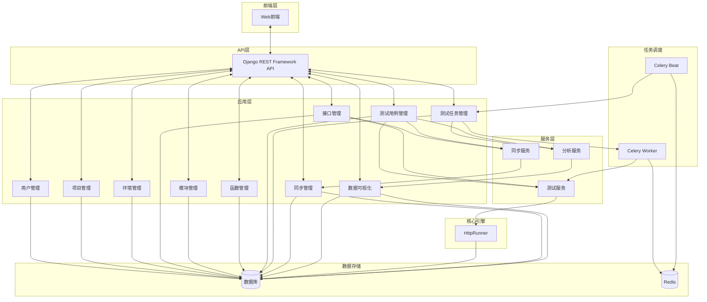

# TestRunner

[](LICENSE)
[](https://www.python.org/)
[](https://www.djangoproject.com/)

TestRunner 是一个基于 Django 和 HttpRunner 构建的自动化测试平台，旨在提供一个完整的接口自动化测试解决方案。该平台集成了项目管理、环境配置、接口管理、测试用例编写、测试任务执行和结果分析等功能，为测试团队提供了一站式的测试服务。

## 项目截图

### 仪表盘界面
xxxx仪表盘界面截图

### 接口管理界面
xxxx接口管理界面截图

### 测试用例编辑界面
xxxx测试用例编辑界面截图

## 项目概述

TestRunner 平台通过整合多种测试工具和技术，提供了一个全面的接口自动化测试解决方案。平台的核心是基于 HttpRunner 测试引擎，结合 Django 框架构建的 Web 应用，支持多种协议的接口测试，包括 HTTP 和 SQL 接口。

平台提供了完整的测试生命周期管理，从项目管理、环境配置、接口定义、测试用例编写到测试执行和结果分析，为测试团队提供了一站式的测试服务。同时，平台还支持接口与测试用例的同步更新，有效降低了测试维护成本。

## 核心功能

### 1. 项目管理

- **项目创建与配置**：支持创建多个项目，并为每个项目配置不同的测试环境和成员
- **成员管理**：可以为项目添加多个成员，并分配不同的权限
- **模块管理**：支持在项目内创建多级模块，便于组织和管理测试资源

### 2. 环境管理

- **多环境支持**：可以为每个项目配置多个测试环境（如开发、测试、预发布、生产等）
- **环境变量**：支持为每个环境配置特定的变量，用于测试用例执行
- **环境继承**：支持环境之间的继承关系，子环境可以继承父环境的配置
- **数据库配置**：支持为环境配置数据库连接信息，用于SQL接口测试

### 3. 接口管理

- **多协议支持**：支持HTTP接口和SQL接口
- **接口定义**：可以定义接口的名称、URL、请求方法、请求头、请求参数等信息
- **接口测试**：支持直接在平台上测试接口，并查看测试结果
- **断言与提取**：支持对接口响应进行断言验证和变量提取

### 4. 自定义函数

- **函数管理**：支持创建和管理自定义Python函数
- **代码安全检查**：对自定义函数进行安全检查，防止危险代码执行
- **函数复用**：自定义函数可以在测试用例中复用，提高测试效率

### 5. 测试用例

- **用例编写**：支持通过Web界面编写测试用例，无需编写代码
- **步骤管理**：测试用例由多个步骤组成，每个步骤可以是接口调用或其他测试用例
- **参数化**：支持测试用例参数化，一次编写多次执行
- **断言验证**：支持对测试结果进行多种方式的断言验证
- **变量提取**：支持从测试结果中提取变量，用于后续步骤

### 6. 测试任务

- **任务调度**：支持手动触发和定时触发测试任务
- **批量执行**：支持批量执行多个测试用例
- **并行执行**：支持测试用例的并行执行，提高执行效率
- **结果分析**：提供详细的测试结果分析，包括成功率、响应时间等指标

### 7. 数据可视化

- **仪表盘**：提供项目整体测试情况的可视化展示
- **趋势分析**：支持测试结果的趋势分析，帮助发现潜在问题
- **报表导出**：支持测试报告的导出，便于分享和存档

### 8. 数据同步

- **接口同步**：支持接口定义与测试用例步骤之间的数据同步
- **配置管理**：可以灵活配置同步字段和同步规则
- **全局设置**：支持项目级别的全局同步配置
- **历史记录**：记录同步操作历史，便于追踪变更

## 架构设计

### 后端架构图



### 后端目录结构

```
TestRunner/                           // 项目根目录
|
|--- TestRunner/                      // 项目核心配置
|--- httprunner/                      // HttpRunner测试引擎
|--- users/                           // 用户管理应用
|--- projects/                        // 项目管理应用
|--- environments/                    // 环境管理应用
|--- interfaces/                      // 接口管理应用
|--- modules/                         // 模块管理应用
|--- functions/                       // 函数管理应用
|--- testcases/                       // 测试用例管理应用
|--- testtasks/                       // 测试任务管理应用
|--- sync/                            // 同步管理应用
|--- dashboard/                       // 数据可视化应用
|--- database_configs/                // 数据库配置应用
|--- logs/                            // 日志目录
|--- pids/                            // 进程ID文件目录
|--- manage.py                        // Django管理脚本
|--- requirements.txt                 // 项目依赖
|--- start.sh                         // 启动脚本
|--- stop.sh                          // 停止脚本
```

## 功能特性

### 接口与用例同步

TestRunner 平台支持接口与测试用例的同步更新，当接口定义发生变化时，可以自动或手动同步到相关的测试用例中，有效降低测试维护成本。

- **同步配置**：可以配置接口与测试用例步骤之间的同步关系
- **字段映射**：支持灵活配置需要同步的字段，如URL、请求方法、参数等
- **同步模式**：支持手动同步和自动同步两种模式
- **批量操作**：支持批量执行多个同步配置，提高工作效率
- **历史记录**：记录所有同步操作的历史，包括同步前后的数据对比

### 同步流程图

xxxx同步流程图

## 使用流程

TestRunner 平台的使用流程简单直观，从项目创建到测试执行，再到结果分析，提供了完整的测试生命周期管理。

### 基本流程

1. **创建项目**：创建测试项目，并添加项目成员
2. **配置环境**：为项目配置测试环境和环境变量
3. **定义接口**：创建和管理测试接口
4. **编写用例**：基于接口创建测试用例
5. **配置同步**：设置接口与测试用例步骤之间的同步关系
6. **执行测试**：手动执行或定时执行测试任务
7. **分析结果**：查看测试报告和分析测试结果
8. **维护更新**：当接口定义变更时，通过同步机制更新测试用例

### 流程图

xxxx使用流程图

## 技术栈

### 后端技术

- **Django**：Web应用框架
- **Django REST Framework**：RESTful API开发框架
- **HttpRunner**：核心测试引擎
- **Celery**：分布式任务队列
- **Redis**：缓存和消息队列
- **MySQL/PostgreSQL**：数据存储

### 前端技术

- 基于现代前端框架构建的响应式Web界面
- RESTful API与后端交互

### 部署技术

- **Gunicorn**：WSGI HTTP服务器
- **Nginx**：Web服务器和反向代理
- **Docker**：容器化部署（可选）

## 安装与部署

### 环境要求

- Python 3.8+
- MySQL 5.7+ 或 PostgreSQL 10+
- Redis 5.0+
- Node.js 14+ (前端开发)

### 开发环境部署

1. 克隆仓库

```bash
git clone https://github.com/yourusername/TestRunner.git
cd TestRunner
```

2. 安装依赖

```bash
pip install -r requirements.txt
```

3. 配置数据库

编辑 `TestRunner/settings.py` 文件，配置数据库连接信息：

```python
DATABASES = {
    'default': {
        'ENGINE': 'django.db.backends.mysql',
        'NAME': 'testrunner',
        'USER': 'your_username',
        'PASSWORD': 'your_password',
        'HOST': 'localhost',
        'PORT': '3306',
    }
}
```

4. 初始化数据库

```bash
python manage.py migrate
python manage.py createsuperuser
```

5. 启动开发服务器

```bash
python manage.py runserver
```

6. 访问平台

开发环境：http://127.0.0.1:8000/

### 生产环境部署

1. 配置生产环境设置

编辑 `TestRunner/settings.py` 文件，修改以下配置：

```python
DEBUG = False
ALLOWED_HOSTS = ['your-domain.com', 'your-server-ip']

# 配置静态文件
STATIC_ROOT = os.path.join(BASE_DIR, 'static')
```

2. 收集静态文件

```bash
python manage.py collectstatic
```

3. 使用启动脚本启动服务

```bash
bash start.sh
```

4. 配置 Nginx

```nginx
server {
    listen 80;
    server_name your-domain.com;

    location /static/ {
        alias /path/to/TestRunner/static/;
    }

    location / {
        proxy_pass http://127.0.0.1:8000;
        proxy_set_header Host $host;
        proxy_set_header X-Real-IP $remote_addr;
    }
}
```

5. 重启 Nginx

```bash
sudo systemctl restart nginx
```

### Docker 部署 (可选)

1. 构建 Docker 镜像

```bash
docker build -t testrunner .
```

2. 启动容器

```bash
docker-compose up -d
```

## 贡献指南

我们欢迎各种形式的贡献，包括但不限于：

- 提交问题和功能请求
- 提交代码修复和新功能
- 改进文档
- 分享使用经验

请查看 [CONTRIBUTING.md](CONTRIBUTING.md) 了解详细的贡献指南。

## 许可证

本项目采用 MIT 许可证，详情请参阅 [LICENSE](LICENSE) 文件。

## 联系我们

- 项目主页：https://github.com/yourusername/TestRunner
- 问题跟踪：https://github.com/yourusername/TestRunner/issues
- 邮箱：your-email@example.com

## 致谢

感谢所有为本项目做出贡献的开发者和用户。特别感谢 [HttpRunner](https://github.com/httprunner/httprunner) 项目提供的强大测试引擎。
